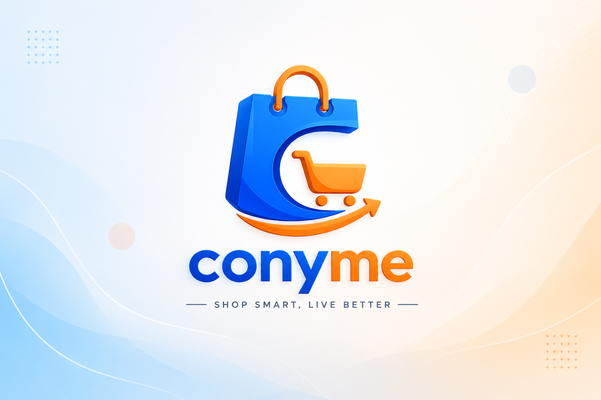
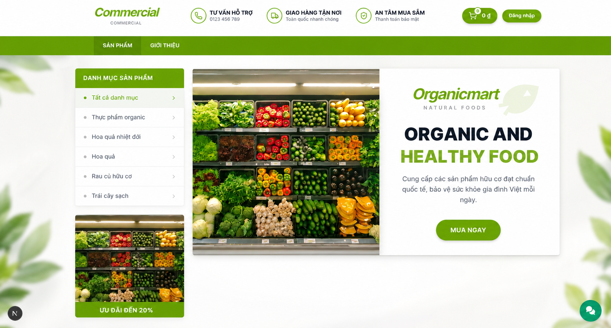
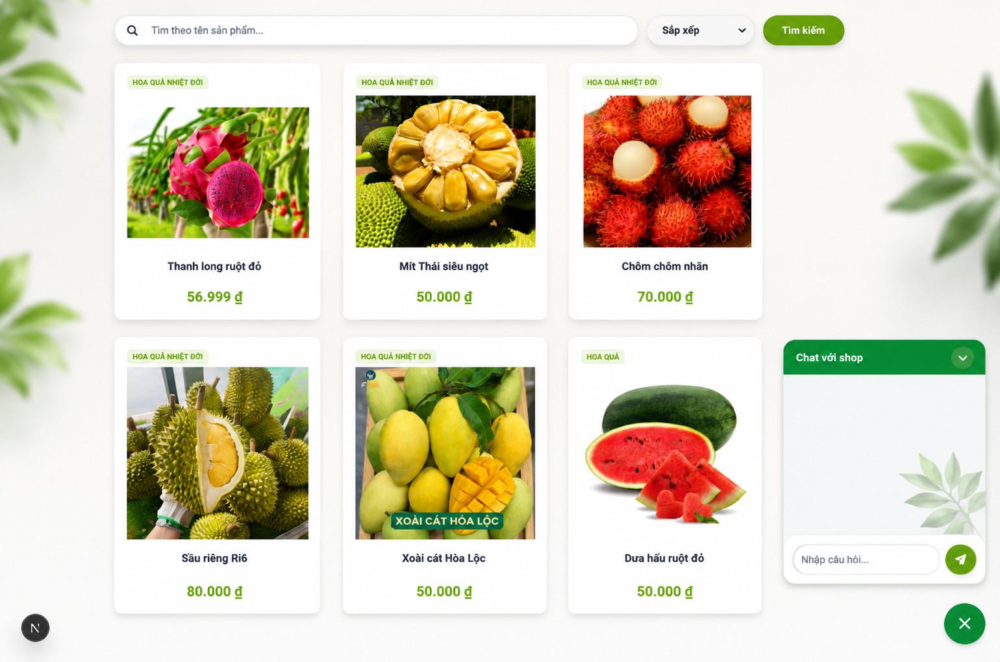
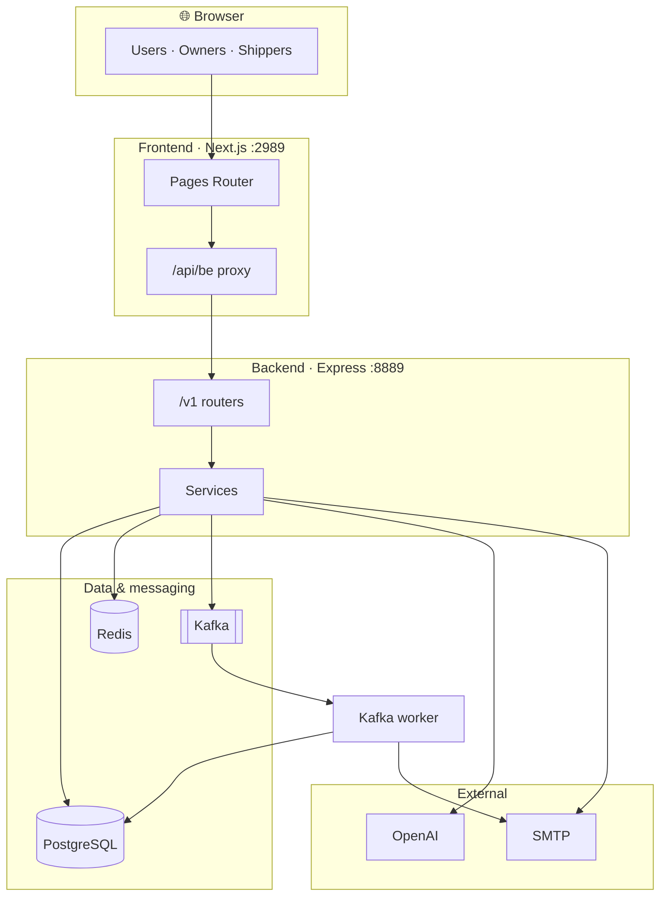

<p align="center">
  
</p>

# E-Commercial App

> Open-source **e-commerce platform** built with **Node.js**, **Express**, **Next.js**, and **PostgreSQL** — multi-role marketplace with checkout, fulfillment, Kafka notifications, and an **OpenAI** policy chatbot.

[](https://nodejs.org/)
[](https://www.typescriptlang.org/)
[](https://nextjs.org/)
[](https://www.postgresql.org/)
[](https://kafka.apache.org/)
[](https://docs.docker.com/compose/)
[](package.json)

**Keywords:** e-commerce · marketplace · order management · shop admin · JWT OAuth · Redis · Sequelize · flash sale · voucher · shipper delivery · AI customer support

---

## Table of contents

- [Why this project](#why-this-project)
- [Features](#features)
- [Architecture at a glance](#architecture-at-a-glance)
- [Tech stack](#tech-stack)
- [Quick start](#quick-start)
- [Documentation](#documentation)
- [Roadmap](#roadmap)
- [Contributing](#contributing)
- [License](#license)

---

## Why this project

Small and medium online shops need more than a product catalog — they need **role-based access**, **transactional checkout**, **delivery workflows**, and optional **AI support**, without stitching together half a dozen SaaS tools.

E-Commercial App is a **full-stack marketplace starter** that ships all of that in one repo:

| Role             | What they get                                                      |
| ---------------- | ------------------------------------------------------------------ |
| **Shopper**      | Catalog, cart, checkout, order tracking, vouchers, AI policy chat  |
| **Shop owner**   | Product & inventory admin, promotions, policies, revenue dashboard |
| **Collaborator** | Zone-based delivery assignments and status updates                 |

Built for **developers**, **startups**, and **contributors** who want production-shaped patterns — layered REST API, event-driven email, Docker Compose — not a toy demo.

---

## Features

<details>
<summary><strong>Shopper</strong> — browse, buy, track</summary>

- Public product search, sort, and catalog APIs
- Cart, checkout (**COD** or simulated **MoMo**), order cancellation
- Delivery status and voucher redemption via credit points
- Streaming **OpenAI** policy chatbot grounded in shop policies
- **Google OAuth** and email/password auth with verification

</details>

<details>
<summary><strong>Shop owner</strong> — run the store</summary>

- Category & product CRUD, image upload, stock history
- Shop policies (feed the AI bot), flash sales, banner ads
- Voucher creation, revenue reporting, user moderation

</details>

<details>
<summary><strong>Collaborator</strong> — fulfill orders</summary>

- Shipper zones (`I1`–`I5`), assignment lifecycle, COD tracking

</details>

<details>
<summary><strong>Platform</strong> — infrastructure patterns</summary>

- JWT auth with role-specific secrets · Redis OTP & signup tokens
- Kafka `order-events` → async confirmation emails · Docker Compose stack
- Next.js API proxy, i18n, security headers

</details>

### Storefront UI

| Homepage                                                                  | Product catalog & detail                                                      |
| ------------------------------------------------------------------------- | ----------------------------------------------------------------------------- |
| Sidebar categories, promo banner, featured products grid                  | Product cards, flash-sale pricing, add-to-cart, AI policy chat widget         |
|  |  |

> Placeholder screenshots — replace image paths when you have real UI captures.

---

## Architecture at a glance



**Request flow:** `Route → Auth → Joi → Controller → Service → DB`

Deep dive → [**Architecture Guide**](docs/ARCHITECTURE.md)

---

## Tech stack

| Layer    | Stack                                                                    |
| -------- | ------------------------------------------------------------------------ |
| Frontend | Next.js 16 · React 19 · Ant Design · Tailwind · TanStack Query · i18next |
| Backend  | Node.js · Express 4 · TypeScript · Joi validation                        |
| Data     | PostgreSQL 15 · Sequelize ORM · Redis 7                                  |
| Events   | Kafka (KafkaJS) — topic `order-events`                                   |
| AI       | OpenAI Chat Completions (streaming policy bot)                           |
| Auth     | JWT · bcrypt · Google OAuth 2.0                                          |
| Ops      | Docker Compose · Nodemailer (SMTP)                                       |

Product search uses SQL `LIKE` — no dedicated search engine.

---

## Quick start

### Prerequisites

Node.js **20+** · Yarn · PostgreSQL **15** · Redis **7** (port `6381`)

Optional: Kafka (`localhost:9092`) for order emails · OpenAI key for the chatbot

### 1 · Clone & install

```bash
git clone <repo-url> e-commercial-app && cd e-commercial-app
yarn install && cd web && yarn install && cd ..
```

### 2 · Configure

```bash
cp .env.example .env
# Required: POSTGRES_*, JWT_SECRET_*_LOGIN, MAIL_*
# Optional: OPENAI_API_KEY, KAFKA_BROKER, GOOGLE_*
```

### 3 · Database

```bash
# Postgres (or use docker compose — see below)
docker run -d --name mini_shop_postgres \
  -e POSTGRES_USER=root -e POSTGRES_PASSWORD=123456 \
  -e POSTGRES_DB=mini_shop_db -p 3321:5432 postgres:15

npx sequelize-cli db:migrate --env development
```

### 4 · Run

```bash
# Terminal 1 — API  →  http://localhost:8889/v1/health
yarn dev

# Terminal 2 — worker (optional)
yarn worker:kafka

# Terminal 3 — UI  →  http://localhost:2989
cd web && NEXT_PUBLIC_API_SERVER=http://localhost:8889 yarn dev
```

### Docker (full stack)

```bash
cd docker && docker compose up -d --build
```

| Service                  | URL                             |
| ------------------------ | ------------------------------- |
| Frontend                 | http://localhost:2990           |
| API                      | http://localhost:8890/v1/health |
| Postgres / Redis / Kafka | `:3322` / `:6382` / `:9093`     |

> Production builds are not included out of the box. See [Deployment](docs/ARCHITECTURE.md#deployment) in the architecture guide.

---

## Documentation

| Doc                                                          | Description                                             |
| ------------------------------------------------------------ | ------------------------------------------------------- |
| [**Architecture**](docs/ARCHITECTURE.md)                     | System design, request lifecycle, database ER, security |
| [**API conventions**](cursor_instruction.md)                 | Route → Controller → Service patterns, response format  |
| [**`.env.example`**](.env.example)                           | Environment variable reference                          |
| [**`docker/docker-compose.yml`**](docker/docker-compose.yml) | Container topology                                      |

### Repository layout

```
src/          Express API — routers, controllers, services, migrations
web/          Next.js storefront & dashboards
docker/       Compose stack & Dockerfiles
docs/         Architecture reference
```

---

## Roadmap

Planned or stubbed — **not production-ready today**:

| Area                    | Notes                                                |
| ----------------------- | ---------------------------------------------------- |
| Real-time (Socket.IO)   | Dependency present; server not wired                 |
| VNPay / real MoMo       | Schema supports `vnpay`; checkout simulates MoMo     |
| Object storage (MinIO)  | Env vars exist; media stored as base64 / disk        |
| RAG / ChromaDB          | Dependency present; bot uses direct prompt injection |
| Job queues (Bull, cron) | Declared in `package.json`; unused                   |
| Quiz / course APIs      | Frontend endpoints only — no backend routes          |
| Homepage                | Placeholder page                                     |
| CI/CD                   | No GitHub Actions workflows                          |
| Multi-tenant shops      | Partial `shop_id` scoping; no tenant table yet       |

---

## Contributing

We welcome PRs. A good contribution starts small and follows existing patterns.

1. Fork → branch from `main` → keep diffs focused
2. Read [**API conventions**](cursor_instruction.md) — controllers never touch the DB directly
3. Add Joi schemas under `src/schemas/` for new inputs
4. Return `{ "code": number, "msg": string, "data": T | null }`
5. Ship Sequelize migrations for schema changes:

   ```bash
   npx sequelize-cli migration:generate --name describe-your-change
   npx sequelize-cli db:migrate --env development
   ```

6. Verify locally: `yarn dev` + `cd web && yarn dev`

**Before opening a PR:** run migrations, hit `/v1/health`, and smoke-test the flow you changed.

Questions about design? Start with [**docs/ARCHITECTURE.md**](docs/ARCHITECTURE.md).

---

## License

[ISC](package.json) — see `package.json` for details.
