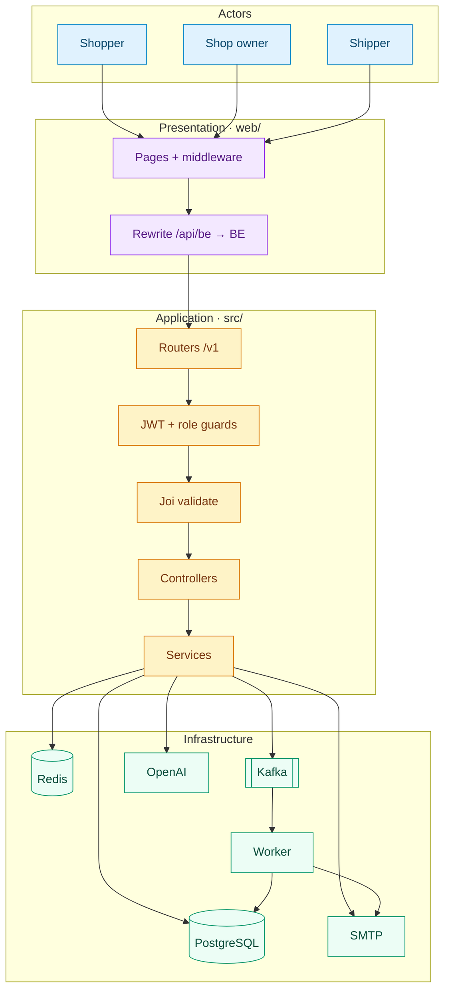
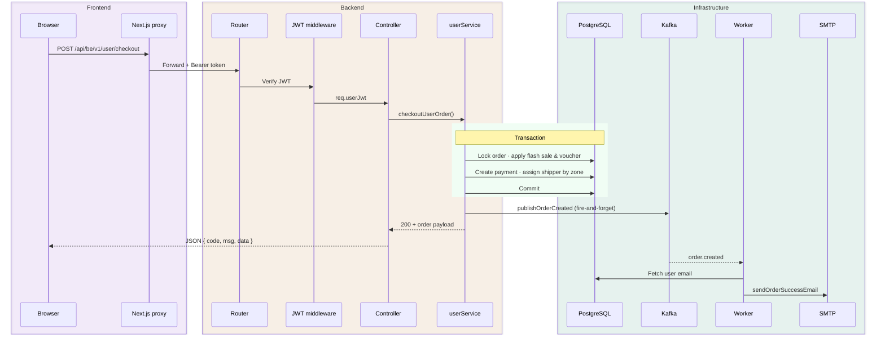
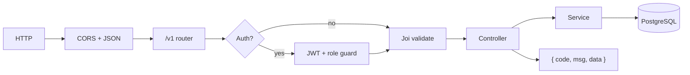
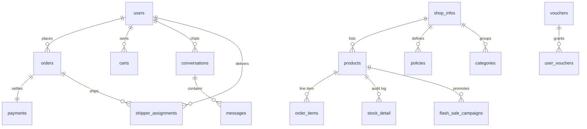
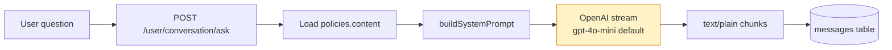
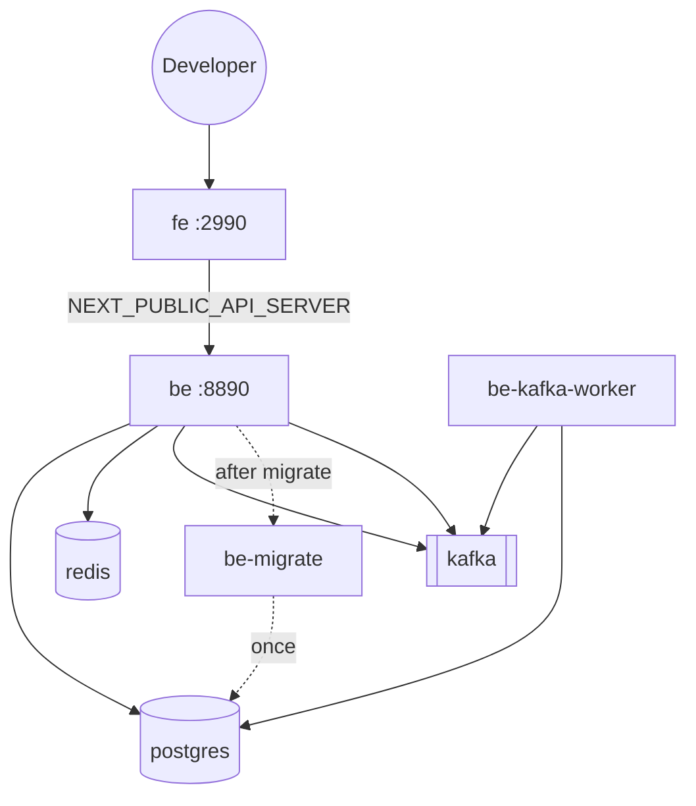

# Architecture Guide

> Technical reference for **E-Commercial App** — a Node.js / Express / PostgreSQL e-commerce backend with a Next.js frontend, Redis session tokens, Kafka event processing, and OpenAI-powered shop policy chat.

← [Back to README](../README.md)

---

## Contents

1. [System overview](#system-overview)
2. [Layer diagram](#layer-diagram)
3. [Request lifecycle](#request-lifecycle)
4. [Core components](#core-components)
5. [Database](#database)
6. [API & auth](#api--auth)
7. [Background processing](#background-processing)
8. [AI policy bot](#ai-policy-bot)
9. [Deployment](#deployment)
10. [Security](#security)
11. [Design decisions](#design-decisions)

---

## System overview

Three tiers, one async side-channel:

| Tier | Technology | Responsibility |
|------|------------|----------------|
| Presentation | Next.js (Pages Router) | UI, cookie auth, `/api/be/*` proxy to backend |
| Application | Express + TypeScript | REST API, Joi validation, business logic |
| Data | PostgreSQL · Redis · Kafka | Persistence, ephemeral auth, async email |

Three **JWT roles** share the same API surface with different route guards:

| Role | Secret env | Capabilities |
|------|------------|--------------|
| `user` | `JWT_SECRET_USER_LOGIN` | Catalog, cart, checkout, orders, AI chat |
| `shopowner` | `JWT_SECRET_SHOPOWNER_LOGIN` | Catalog admin, promotions, policies, analytics |
| `collaborator` | `JWT_SECRET_COLLABORATOR_LOGIN` | Delivery by zone |

Google OAuth endpoints exist for each role. Email/password auth uses Redis-staged verification and bcrypt.

---

## Layer diagram



---

## Request lifecycle

### Checkout sequence

`POST /v1/user/checkout` — synchronous order commit, asynchronous email.



### Standard pipeline

Every endpoint follows the same middleware chain:



Convention details → [`cursor_instruction.md`](../cursor_instruction.md)

---

## Core components

### Entrypoint — `src/index.ts`

- Boots Redis, Kafka **producer**, SMTP, Postgres
- Mounts `/v1` routers; health at `/v1/health`
- Serves static media: `/videos/*`, `/video_comment/*`
- Kafka producer failure is **non-fatal** (logged, API stays up)

> Socket.IO is listed in dependencies but not initialized. *Inferred: planned, not implemented.*

### Routers

| Module | Mount | Scope |
|--------|-------|-------|
| `userRouter` | `/v1/user/*` | Auth, cart, orders, checkout, conversation |
| `shopownerRouter` | `/v1/shopowner/*` | Catalog, inventory, promos, policies, users |
| `collaboratorRouter` | `/v1/collaborator/*` | Deliveries, shipper zones |
| `commonRouter` | `/v1/public/*` | Public catalog, search, sort |

### Controllers & services

Controllers are thin HTTP adapters — **no direct DB access**. Services own Sequelize queries and transactions.

| Service | Key domains |
|---------|-------------|
| `userService.ts` | Cart, checkout, flash sale, vouchers, credits, policy bot, cancel order |
| `signUp.service.ts` | Registration + Redis verification tokens |
| `passwordAuth.service.ts` | Sign-in, OTP reset, change password |
| `shopwnerService.ts` | Catalog CRUD, ads, flash sales, policies, revenue |
| `collaboratorService.ts` | Delivery list + status patches |

### Auth middleware — `jwt.auth.ts`

1. Parse `Authorization: Bearer <token>`
2. Verify against secrets (admin → user → collaborator → shopowner)
3. Attach `req.userJwt`; shop routes also set `req.shopId` from `shop_infos`

Multi-shop selection via `x-shop-id` header or `shopId` query is **partial** — defaults to `findOne` when omitted.

---

## Database

### Conventions

- **Sequelize 6** · PostgreSQL · UUID string PKs · snake_case columns
- Migrations in `src/migrations/` via sequelize-cli

### Entity relationships



### Ownership model

| Data | Scoped by |
|------|-----------|
| Products, categories, policies, ads, flash sales | `shop_id` → `shop_infos.id` |
| Carts, orders, conversations | `user_id` |
| Shipper assignments | `order_id` + shipper `user_id` |

### Notable tables

| Table | Role |
|-------|------|
| `payments` | `method`: `cod` · `momo` · `vnpay`* |
| `shipper_infor` | Zones `I1`–`I5` for auto-assignment at checkout |
| `messages` | Ordered Q&A pairs for the policy bot |

\* `vnpay` is schema-only. Checkout accepts **COD** and **simulated MoMo** (no payment SDK).

*Inferred:* model comments reference a future `tenant` table for full multi-shop isolation.

---

## API & auth

### Response envelope

```typescript
interface ApiResponse<T> {
  code: number;
  msg: string;
  data: T | null;
}
```

List endpoints use `page` + `page_size` query params.

### Auth endpoints

| Flow | Route |
|------|-------|
| Google OAuth | `POST /v1/{user\|shopowner\|collaborator}/oAuth-login` |
| Sign up | `POST /v1/user/sign-up` → email verify via Redis token |
| Sign in | `POST /v1/user/sign-in-pw` |
| Reset password | `POST /v1/user/tke-code` · `POST /v1/user/fg-pasw` |

Frontend stores JWT in cookie `token` + `localStorage` (`web/utils/tokenManager.ts`). Next.js middleware protects `/checkout`, `/account`, admin routes.

### Checkout rules

1. Order belongs to authenticated user
2. Flash sale discount per active campaign
3. Optional voucher → marks `user_voucher` used
4. Shipper matched by delivery zone → `shipper_infor`
5. **COD** → payment `waiting` + COD on assignment · **MoMo** → instant `success` (simulated)
6. Success → Kafka `order.created`

---

## Background processing

### Kafka

| File | Role |
|------|------|
| `kafka/producer.ts` | Publish after checkout |
| `kafka/consumers/orderConsumer.ts` | Consume `order-events` |
| `workers/kafkaWorker.ts` | Standalone: `yarn worker:kafka` |

**Topic:** `order-events` · **Consumer group:** `order-worker-group`

```json
{
  "event": "order.created",
  "orderId": "uuid",
  "userId": "uuid",
  "totalPrice": 150000,
  "paymentMethod": "cod",
  "status": "processing",
  "timestamp": "2026-06-06T12:00:00.000Z"
}
```

Order state is **always** committed synchronously. Kafka only triggers confirmation email — no DLQ or retry queue today.

### Redis (auth only)

| Key | TTL | Purpose |
|-----|-----|---------|
| `signup:verify:{code}` | 600s | Pending registration |
| `signup:email:{email}` | 600s | Email → code index |
| `reset-pw:verify:{code}` | 600s | Password reset OTP |
| `reset-pw:email:{email}` | 600s | Email → OTP index |

Helpers: `src/config/redis.ts` (`put`, `get`, `setString`, `exists`, `del`).

### Declared but unused

`bull` · `node-cron` · `socket.io` · `chromadb-default-embed` — in `package.json`, no references in `src/`.

---

## AI policy bot

A **customer-support bot**, not a general agent framework. Context comes from the `policies` table — **no RAG, no vector store**.



| Setting | Env / default |
|---------|---------------|
| Model | `OPENAI_CHAT_MODEL` → `gpt-4o-mini` |
| Max tokens | `OPENAI_POLICY_BOT_MAX_TOKENS` → 60 (clamped 60–256) |
| Missing key | `503 OPENAI_NOT_CONFIGURED` |
| History | `GET /user/conversation/history?shopId=` |

Prompt rules (`buildSystemPrompt` in `userService.ts`): answer only from policy text · 1–2 Vietnamese sentences · refuse off-topic · admit gaps.

**Future RAG hook:** replace `getPolicyContentByShopId()` before prompt assembly. ChromaDB dependency suggests this was considered.

---

## Deployment

### Docker Compose



| Service | Port | Notes |
|---------|------|-------|
| `fe` | 2990 | Next.js dev, `web/` volume mount |
| `be` | 8890 | Express dev, `src/` volume mount |
| `be-kafka-worker` | — | `yarn worker:kafka` |
| `be-migrate` | — | sequelize-cli, exits 0 |
| `postgres` | 3322 | Volume `postgres_data` |
| `redis` | 6382 | AOF enabled |
| `kafka` | 9093 | Single-node KRaft 3.7 |

Compose file → [`docker/docker-compose.yml`](../docker/docker-compose.yml)

### Environment

| Group | Variables |
|-------|-----------|
| Server | `AGENT_PORT`, `NODE_ENV`, `API_BASE_URL` |
| Postgres | `POSTGRES_HOST`, `POSTGRES_PORT`, `POSTGRES_USER`, `POSTGRES_PASSWORD`, `POSTGRES_NAME`, `POSTGRES_SSL_MODE` |
| Postgres prod | `POSTGRES_*_PROD` when `NODE_ENV !== development` |
| Cache / events | `REDIS_HOST`, `REDIS_PORT`, `KAFKA_BROKER` |
| Auth | `JWT_SECRET_*_LOGIN`, `JWT_EXPIRE`, `GOOGLE_*` |
| Mail / AI | `MAIL_*`, `OPENAI_API_KEY`, `OPENAI_CHAT_MODEL` |
| Frontend | `NEXT_PUBLIC_API_SERVER`, `FRONTEND_URL_DEV`, `FRONTEND_URL_PROD` |

### Production gap

Images run **`yarn dev`** with source mounts — optimized for local/staging, not hardened production. For prod: compile backend (`tsc`), `next build && next start`, remove volume mounts, tighten CORS, add secrets manager.

No Kubernetes, Terraform, or cloud manifests in repo.

---

## Security

| Area | Implementation |
|------|----------------|
| Passwords | bcrypt hash; stripped from API responses |
| Tokens | Role-specific JWT secrets |
| OAuth | `google-auth-library` |
| Transactions | Row locks on checkout, voucher claim, cancel |
| Frontend | `X-Frame-Options: DENY`, `nosniff`, restrictive Permissions-Policy |
| Secrets | dotenv; never commit `.env` |

### Known gaps

| Gap | Mitigation |
|-----|------------|
| CORS `*` | Restrict to `CLIENT_CORS` in production |
| Simulated MoMo | Integrate real payment webhooks |
| Base64 images in DB | Move to object storage (MinIO env stub exists) |
| No rate limiting | Redis-backed limiter on auth routes |
| No CI scanning | Add GitHub Actions + `npm audit` |

---

## Design decisions

| # | Decision | Why | Trade-off |
|---|----------|-----|-----------|
| 1 | Monorepo, separate `package.json` | Independent deploy & dev cycles | Two Yarn installs |
| 2 | Services own transactions | Consistent atomicity | Large service files |
| 3 | Sync checkout + async email | Simple consistency | Email is best-effort, no retry |
| 4 | Prompt injection, not RAG | Zero retrieval infra | Doesn't scale to long policies |
| 5 | Simulated MoMo | End-to-end demo without credentials | Not production-safe |
| 6 | Next.js `/api/be` proxy | Fixes OAuth CORS | Extra hop; env must match |
| 7 | UUID PKs | Safe distributed IDs | Larger indexes |
| 8 | Compose runs dev mode | Fast contributor onboarding | Not prod-hardened |

---

## See also

- [README](../README.md) — quick start & feature overview
- [API conventions](../cursor_instruction.md)
- [Environment template](../.env.example)
